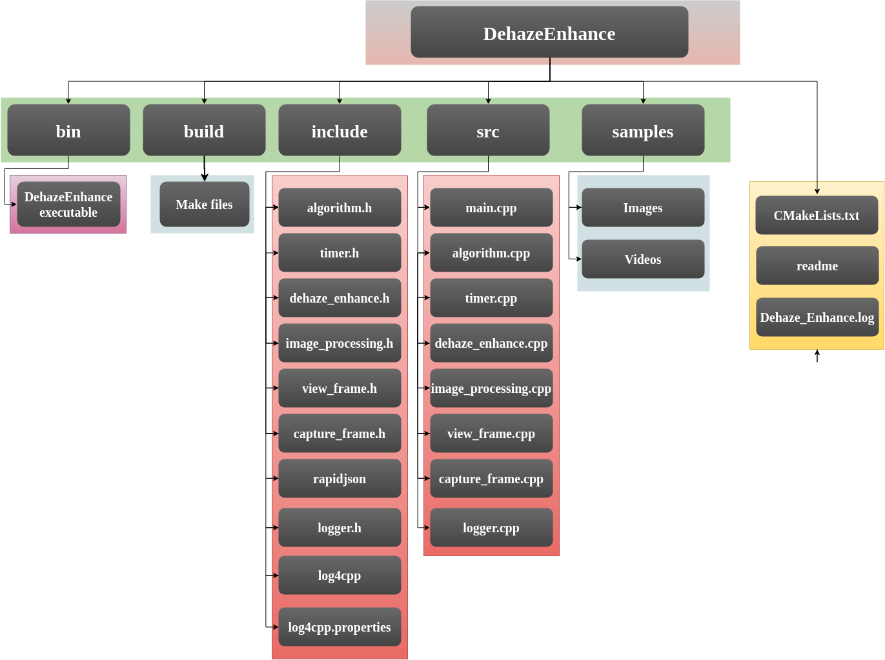
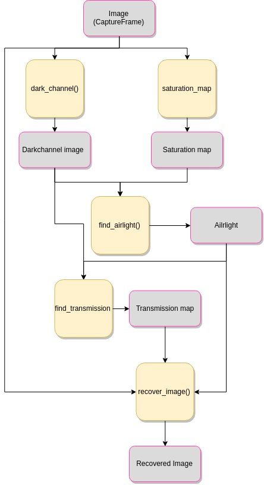
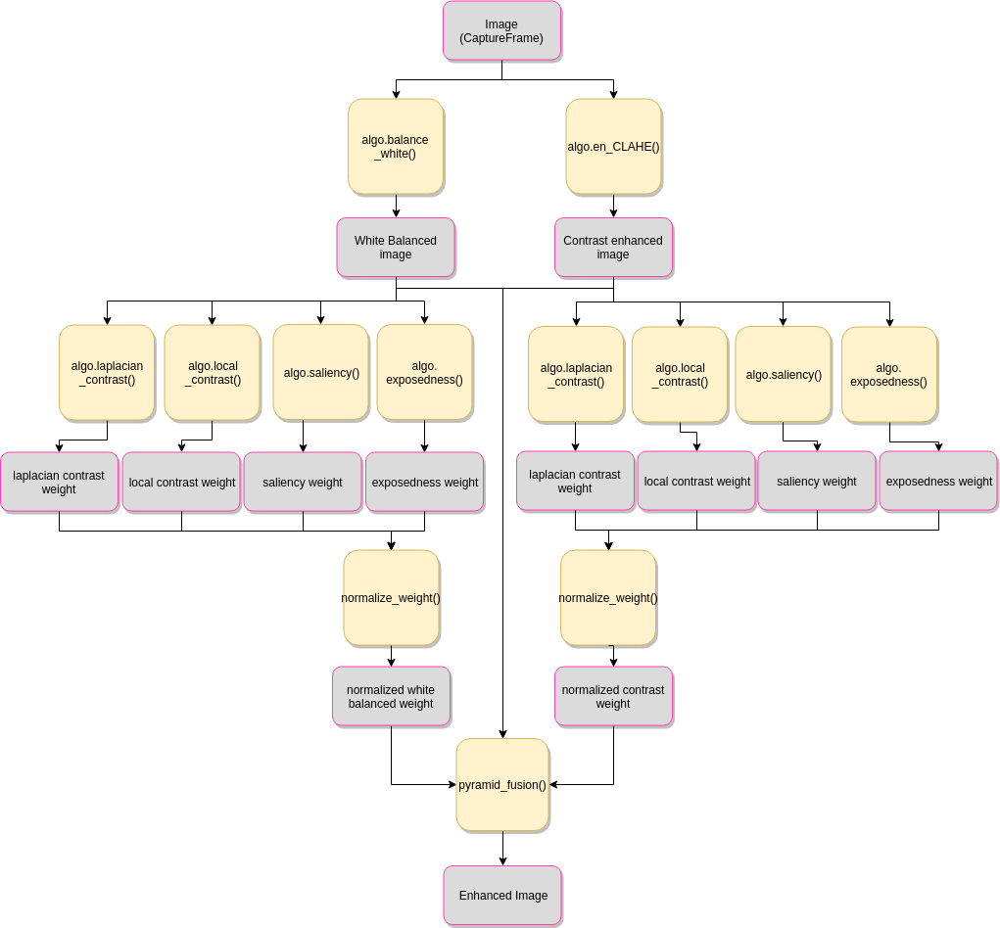

# DEHAZE AND ENHANCE
---------------------                                
<div style="text-align: right"> Planys Technologies </div>

### Enhancing underwater images and videos will restore the contrast and color that was lost due to scattering and preferential absorption of color.


## SETIING UP
Make sure you have the following files in your system

1. main.cpp
2. dehaze_enhance.cpp
3. dehaze_enhance.h
4. image_processing.cpp
5. image_processing.h
6. view_frame.cpp
7. view_frame.h
8. capture_frame.cpp
9. capture_frame.h
10. timer.cpp
11. timer.h
12. algorithm.cpp
13. algorithm.h
14. logger.cpp  
15. logger.h
16. log4cpp.properties
17. Image_Mosaic.log (will be automatically created if not)
18. CMakeLists.txt

Dependencies

1. Opencv 3.4
2. rapidjson
3. log4cpp

### File System
-------------




Now to compile, move to the main directory and run the following commands on terminal.

```
cd build
cmake ..
make
```
The code offers enhancement of both image and video in two algorithms.
To Execute the code, change the directory to bin.
```
cd bin
```
### Configuration File

#### Program Execution
1. DebugMode : 

    "true" : Log file will be written to disk, Debug logs will be recorded.

    "false" : Log file will not be written. All logs above Debug flag will be shown in console.

2. RunnningMode : 

    "commandline" : run with arguments list in terminal.

    "GUI" : Run with information flow from GUI layer.

    "automated" : Run with Directory for enhancing every file in it.

3. ExeMode : 

    "DEV" : Developer mode. This will display every windows during execution.

    "EXE" Execution mode. This will suppress every windows displays. Output files will be written

#### General Settings
1. DefaultVideo : 

    "PathToVideo" : This video file will be used when no file are supplied by the user.

2. DefaultImage : 

    "PathToImage" : This image file will be used when no files are supplied by the user.

3. RegionOfInterest_x

    integer(0,100) : Distance to the left side of Region of interest in percentage of width.

4. RegionOfInterest_y

    integer(0,100) :  Distance to the top side of Region of interest in percentage of height.

5. RegionOfInterest_width

    integer(0,100) :  Width of Region of interest in percentage of width.

6. RegionOfInterest_height

    integer(0,100) : Height of Region of interest in percentage of height.

#### Fusion

1. PyramidLimit : 

    integer(>0) : The level of pyramid transformation in blending for Fusion algorithm.

2. WhiteBalanceAlgorithm : 

    "Simple"  : Simple white balancing algorithm for Fusion enhancing.

    "GreyWorld" : Greyworld algorithm for white balancing for Fusion enhancing.

#### Dark Channel Prior

1. DarkChannelPatchSize : 

    integer(>0) : The width and height in pixels for the patch used in dark channel calculation. Lesser the patch size, faster the algorithm

2. SaturationWeight : 

    fraction (0.0,1.0) : The weightage given to saturation for finding airlight in the scene.

3. DarkChannelWeight : 

    fraction (0.0, 1.0) : The weightage given to dark channel for finding airlight in the scene.
4. AirlightLimit : 

    fraction (0.0, 1.0) : The Threshold for airlight filtering after getting the weighted input from saturation and dark channel.


#### Commandline execution

The commandline running mode is given below.
```
./DehazeEnhance <1st argument> <2nd argument> <3rd argument>
```

**1st argument** : input

_image_ : Enhancement of image 

_video_ : Enhancement of video


**2nd Argument** : file location

_Location to image or video file relative to program root directory_

**3rd argument** : algorithm

_DCP_ : Dark Channel Prior Algorithm

_fusion_ : Fusion algorithm


## PROGRAM ACCESSIBLE PARAMETERS

( *for the following section, 'de_en' is used as an object to the class DehazeEnhance* )


### Public functions that can be used set parameters for Laser Ranging

1. de_en.dark_channel_prior()

    The dark channel prior algorithm for image


3. de_en.show_airlight()

    This will show the identified airlight color in image.


## Program Flow
### Dark Channel Prior


### Fusion



## **INCLUDED FILES**


## 1. dehaze_enhance.cpp   
            
 ### Class DehazeEnhance

 Derived class of Class ImageProcessing. Have functions and variables exclusively used for Image Enhancing  .

#### Functinos

 * void dark_channel_prior()              :
    
    *Enhance image with dark channel prior algorithm*              
 * void find_airlight()   : 
    
    *finding background color*
 * void show_airlight()   : 
    
    *showing the calculated airlight color*

 * void find_transmission()             : 
    
    *find transmission map of every channel*
 * void recover_image()     : 
    
    *Recover Enhance dehaze image using the transmission map of every channels*
 * void recover\_image_shallow()     : 
    
    *Recover image by using pointers instead of passing a copy. used in region of interest*      
 
 * void fusion()       : 
    
    *Function to enhance images with fusion algorithm*        
 
 * void normalize_weight()       : 
    
    *Function to normalize weights through all the weights used.* 
 *   fusion_blender()                  : 
    
      *A basic blending function for blending according to weights*   
 * void pyramid_blending()     : 
    
    *Better blending funtion which uses pyramid transformations*
 * void video_enhance(string algorithm,CaptureFrame video)                   : 
    
    *Function to enhance video and write the enhanced video into a seperate file*

 * int comparison()       : 
    
    *wreite enhanced and original video to another video file pasting them side by side* 

 ***Public Variables***
 * roi_percentage             : 
        
    *to select the region of interest for enhancing*

 
## 2. image_processing.cpp

### Class ImageProcessing

Class Imageprocessing will have the basic image processing functionalities. This class will be the parent class class for most of the other image processing classes.


**Functions**

  *  CaptureFrame roi_selection(CaptureFrame)                 :
     
     *Crop the region of interset*
  * CaptureFrame hsv_segmentation  (CaptureFrame)              : 
        
     *Segment image according to color set previously (preset for red)*
 *  void set_threshold (CaptureFrame)                : 
        
    *set color threshold according to scene or manual input*
 * void set_roi  (int x_percent,int y_percent,int width,int height)                       : 
        
   *Set region of interset*

  ***Public Variables***

 * threshold_high_0                : 
        
    *to set high value of color threshold in 0 hue range*
 * threshold_high_180              : 
        
    *to set high value of color threshold in 180 hue range*
  * threshold_low_0                 : 
        
     *to set low value of color threshold in 0 hue range*
 * threshold_low_180               : 
        
    *to set low value of color threshold in 180 hue range*
 * roi_percentage                  : 
       
    *to set required region of interest percentage*

## 3. algorithm.cpp

### Class Algorithm

Algorithm class will contain all the algorithms needed for image processing. one object of this class will be present in ImageProcessing class.

***Functions***
    
* CaptureFrame CLAHE_dehaze(CaptureFrame)                     : 
        
     *Dehaze using CLAHE algorithm*
 * CaptureFrame hist_equalize (CaptureFrame):                     : 
       
    *Dehaze using normal histogram equalization.*
* AKAZE_feature_points(CaptureFrame,CaptureFrame)
    
    *Feature point identification using AKAZE algorithm*
* ORB_feature_points(CaptureFrame,CaptureFrame)
    
    *Feature point identification using ORB algorithm*


## 4. view_frame.cpp

### Class ViewFrame

ViewFrame class is used for displaying the images. This class offers multiple modes of displaying including multiple displays(upto 4 frames) and interrupted displays(waits for user input and then continue)

***Functions***

 * void single_view_interrupted   (CaptureFrame)      : 
        
     *Show single window and wait for user input to continue*
 *  void single_view_uninterrupted (CaptureFrame)      : 
        
     *Show single window and continue*
 * void multiple_view_interrupted  (CaptureFrame,CaptureFrame,CaptureFrame,CaptureFrame)     : 
        
     *Show multiple windows and wait for user input to continue*
 * void multiple_view_uninterrupted (CaptureFrame,CaptureFrame,CaptureFrame,CaptureFrame)    : 
        
    *Show multiple windows and continue*
 * CaptureFrame add_overlay_percent (CaptureFrame input, x_percent,y_percent,data)            : 
        
   *Add overlays to the image at a point according to percentage*
 * CaptureFrame add_overlay (CaptureFrame,x_point , y_point, data)                    : 
        
    *Add overlays to the image at the specified point*

 * CaptureFrame join_image_horizontal (CaptureFrame image1,CaptureFrame image2)                    : 
        
    *Takes two images and join them horizontlly to one single bigger image. Used in every multiple output functions*

 * CaptureFrame add_overlay (CaptureFrame image1,CaptureFrame image2)                  : 
        
    *Takes two images and join them vertically to one single bigger image. Used in every multiple output functions*
        
## 5. capture_frame.cpp

### Class CaptureFrame

CaptureFrame class is used as a substitute for image and video files. It holds one image and one video file and associated functions to load,manipulate,retrieve them.

 **Functions**

  * void capture_image (filename,window_name)                  : 
        
    *load image*
 * void capture_video     (filename,window_name)               : 
    
    *load video*

 * void reload_image        (image,window_name)             : 
    
    *rewrite existing image*

 * void reload_video       (video,window_name)             : 
    
    *rewrite existing video*

 * CaptureFrame retrieve_image                  : 
    
    *extract stored image*
 *  CaptureFrame retrieve_video                  : 
    
     *extract stored video*
 * void frame_extraction                : 
    
   *extract frame from video and store it in  image*
    . clear                           : 
    
    *clear all the data in the object
        
## 6. **timer.cpp**    

### Class Timer

Timer class is used for measuring the execution time and maximum fps. It calculates the time between timer initialising and timer ending.


 ***Functions***

 * timer_init ()                     : 
        
     *start the timer*
 * timer_end                ()       : 
        
     *end the timer and calculate execution time and maximum fps*
 * CaptureFrame add_time ()                       :    
       
     *add execution timer as overlay to image*
 * CaptureFrame add_fps   ()                      : 
    
     *add maximum fps as overlay to image*

 ***Public Variables***

 *    execution_time                  : 
    
         *to extract the execution time data*

 * fps  :

     *to extract the maximum fps data*
        

## 6. **logger.cpp**    

### Class Logger

Logger class is used for logging the state of the program during execution. A local log file named "Laser_Ranging.log" will be updated during the execution with time stamp and messages. Only logs which have equal and higher priority than WARN will shown in console. Every logs(all priorities) are written in log file.


 ***Functions***

 * void log_error (message)                     : 
        
     *record a log in error priority.*

 * void log_warn (message)      : 
        
     *record a log in warning priority.*

 * void log_info (message)                         :    
       
     *record a log in info priority.*

 * void log_debug (message)                        : 
    
     *record a log in debug priority.*

 * void logger_initialize()                        : 
    
     *initialize logger and link it to the local file. A file called log4cpp.properties are used for this purpose. it also determins the layout of recording log*


## Program Execution Time

Program's execution times are very important in terms of scalability and reliability. 

Input used : 1080p

### System - 1
     CPU   - Intel i7 5th Generation octa core
     RAM  - 16 GB
    Ubuntu 16.04

## Fusion

| Tasks                 |   Time Taken  (ms)                    |
| -------               | ----------                            |
| Prepare Inputs        |   113.29                             |
| Prepare Weights       |   200.67  |
| Normalize weights    |   27.72                                 |
| Pyramid Blending|   64.68                            |
|    |   |
| Total               |   406.41                               |


## Dark Channel Prior

| Tasks                 |   Time Taken  (ms)                    |
| -------               | ----------                            |
| Dark channel preparation        |   2079.68                             |
| Saturation preparation       |    16.04  |
| Airlight calculation    |   33.29                                 |
| Transmission map calculation    |   64.68                            |
| Recovery of image    |   66.31                           |
|    |   |
| Total               |   2194.18                              |
