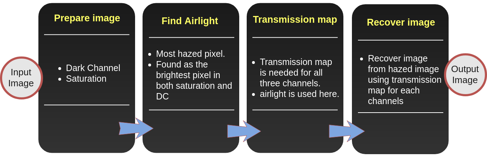
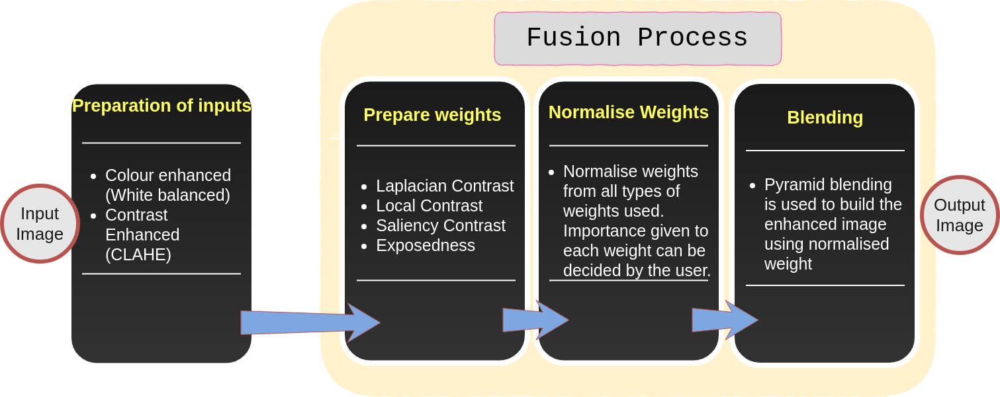

# DEHAZE AND ENHANCE
--------------------

**Planys Technologies**

## __Overview__

### Dark Channel Prior

### Fusion

_Underwater images and videos suffer from quality loss because of color shift(the blue,green,yellow,grey hue according to the water type) and less contrast(backward and forward scattering in water). This makes the image blurry and to have untrue colors_

_This program will recover the original color and contrast from the underwater image and thus enhances the image_

## This Program has two Algorithms for underwater image enhancement
### 1. Dark Channel Prior
### 2. Fusion

## DARK CHANNEL PRIOR 

DCP algorithm uses the mathematical model for the  hazed images and find air light and transmission map from given image and recover the dehazed image using these information. This method uses dark channel to find air light and transmission map.

### STEPS

1. Find Airlight(Background color)
2. Find transmission map for each channels.
3. Recover Dehazed image.

## 1. Finding Airlight

Airlight is defined as the color most hazed pixel in the image.
One method to find the background light is to take the most brightest pixel in the picture. However in the presence of sunlight or any reflective surface, this will result in bad estimation and will affect the subsequent processes considerably. 

Hazed pixel will be having higher values in dark channel and for haze-free pixels, dark channel will approach zero(with an exception for sky). Also, for background light, the value of saturation will be higher.​

So in this method, We are filtering higher values from fused image of dark channel and saturation map after a basic histogram equalization.

Finding the air light is the crucial step of this method. Subsequent steps are completely mathematical. So the quality of output and the extent of dehazing depends on obtaining the correct background light.

## 2. Finding transmission map

After finding background color, it is used to find transmission map for all the channels in the image. 

## 3. Recovering Image

Transmission maps are used to recover each channels of the image and they are are fused to get the final image.